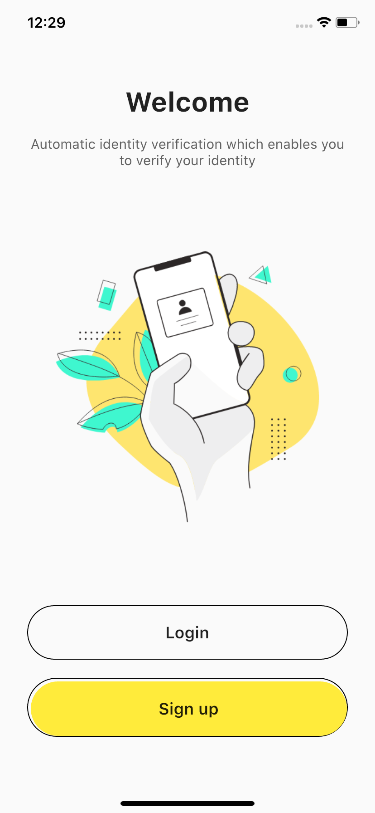
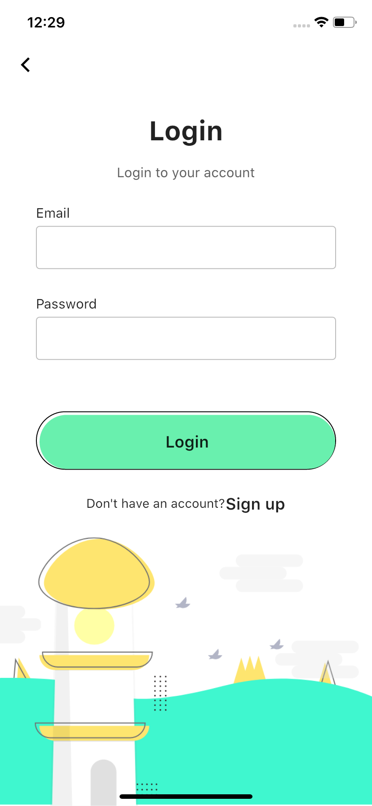

# Flutter UI | Beautiful Login and Signup Page UI/UX Design & Animation

Flutter Beautiful Login and Signup Page UI/UX design and Animation - day 23 Flutter Animation and UI Design.

This repository is a part of the 100-day design in Flutter.

In this video, we use Flutter Container, MaterialButton, BoxDecoration, DecorationImage, MediaQuery, Row, Column, FadeAnimation, Navigator, Icon, Icons, Border, BorderSide, RoundedRectangleBorder, BorderRadius, Text, and so on in the one-speed video.

Designed by [Yasir Ahmad Noori (@yasirnoori.yn)](https://bit.ly/2Lswf9j) on Instagram

[Youtube Video](https://www.youtube.com/watch?v=Hq7Wj6DshNs)

## Last Design
- [UI Design- Day 1](https://github.com/afgprogrammer/flutter-inspiration-app-ui)
- [UI Design- Day 2](https://github.com/afgprogrammer/Flutter-trip-app-ui)
- [UI Design- Day 3](https://github.com/afgprogrammer/Flutter-food-delivery-app-ui)
- [UI Design- Day 4](https://github.com/afgprogrammer/Flutter-actors-profile-app-ui)
- [UI Design- Day 5](https://github.com/afgprogrammer/Flutter-ripple-map-application)
- [UI Design- Day 6](https://github.com/afgprogrammer/Flutter-page-transition-animation)
- [UI Design- Day 7](https://github.com/afgprogrammer/Flutter-button-animation)
- [UI Design- Day 8](https://github.com/afgprogrammer/Flutter-Splash-Screen-Animation)
- [UI Design- Day 9](https://github.com/afgprogrammer/Flutter-Party-Event-Application)
- [UI Design- Day 10](https://github.com/afgprogrammer/Flutter-GridView-Example-UI)
- [UI Design- Day 11](https://github.com/afgprogrammer/Flutter-Travel-Application)
- [UI Design- Day 12](https://github.com/afgprogrammer/Flutter-Login-Page-UI)
- [UI Design- Day 13](https://github.com/afgprogrammer/Flutter-Login-Page-Design)
- [UI Design- Day 14](https://github.com/afgprogrammer/Flutter-Login-Page-3)
- [UI Design- Day 15](https://github.com/afgprogrammer/Flutter-Shoes-Shop-App)
- [UI Design- Day 16-17](https://github.com/afgprogrammer/Flutter-Complete-e-commerce)
- [UI Design- Day 18](https://github.com/afgprogrammer/Flutter-Custom-Carousel)
- [UI Design- Day 19](https://github.com/afgprogrammer/Flutter-Facebook-Redesign)
- [UI Design- Day 20](https://github.com/afgprogrammer/Flutter-Socks-Shop)
- [UI Design- Day 21](https://github.com/afgprogrammer/Flutter-App-Intro-With-Indicator)
- [UI Design- Day 22](https://github.com/afgprogrammer/Flutter-Photography-Application)

## ScreenShot

&nbsp;
&nbsp;
